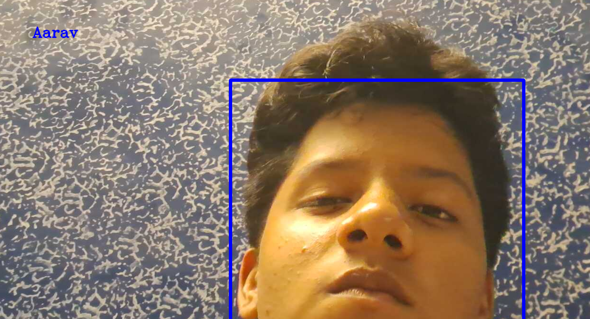

# 👤 Human Face Recognition using CNN, OpenCV & IP Webcam
A complete end-to-end pipeline for real-time human face recognition — from dataset creation using an IP camera to model training with CNN and deployment using OpenCV. This project was developed as part of a hands-on AI/ML training at CTTC, Bhubaneswar.

## 📌 Overview
This project enables real-time face recognition using a custom-trained Convolutional Neural Network (CNN). Images are captured using a mobile phone's camera (via IP Webcam), processed and labeled locally, trained in Google Colab using Keras, and finally deployed using OpenCV for live prediction.

## 🧱 Project Structure
File	Purpose

| File                                 | Description                                                                                                       |
|--------------------------------------|-------------------------------------------------------------------------------------------------------------------|
| `collect_data.py`                    | Collects 100 face images per person using mobile camera via IP Webcam. Images are manually cleaned for quality.  |
| `consolidate_data.py`                | Preprocesses and compresses face images, converts them to grayscale, and pickles the data (`images.p`, `labels.p`). |
| `Face_Recognition_Harsita.ipynb`     | Google Colab notebook for model training: loads pickled data, preprocesses it, builds and trains a custom CNN, and saves the final model. |
| `haarcascade_frontalface_default.xml`| Pre-trained Haarcascade file used for face detection in both data collection and real-time recognition.           |
| `recognize.py`                       | Loads the final trained model and applies it to real-time video feed for live face recognition using OpenCV.     |

## 🚀 Workflow
- Image Collection
Use collect_data.py to gather face images via mobile camera (IPWebcam). Manually remove poor-quality images.

- Data Consolidation
Use consolidate_data.py to preprocess and pickle the image data (images.p, labels.p).

- Model Training (Google Colab)

- Upload pickled files

- Normalize and preprocess data

- Encode labels

- Train a custom LeNet-style CNN using Keras with dropout and stratified validation

- Save the model (final_model.h5)

- Real-time Recognition
Use recognize.py to perform live face recognition through the webcam using the trained model and Haarcascade detection.

## 🛠 Tech Stack
Languages & Frameworks: Python, Keras, TensorFlow, OpenCV

Libraries: NumPy, Pandas, Pickle, scikit-learn

Tools: Google Colab, IP Webcam, Haarcascade

## 📷 Sample Output

